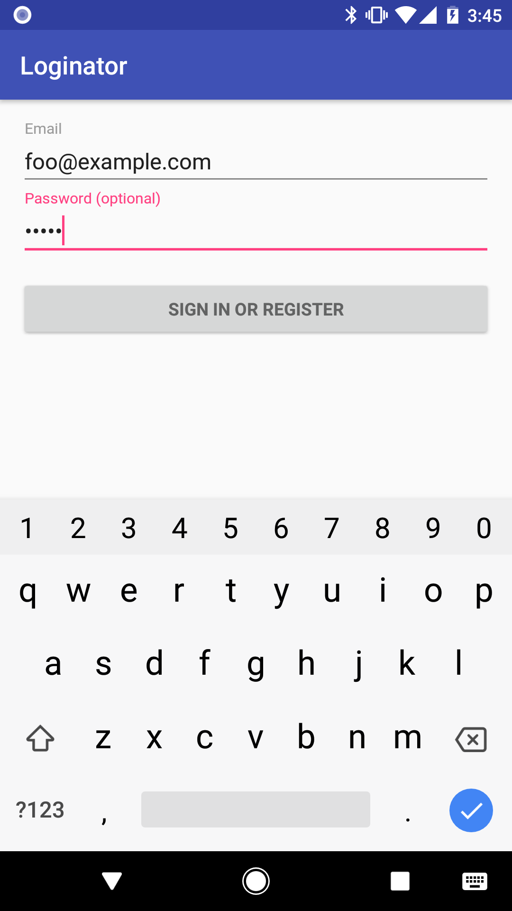

# Loginator
Clean architecture case study based on the Android Studio login template

## Prerequisites
* Android Studio 3.0
* API 26
* Kotlin

## Overview
Demo built using a modified version of Model-View-Presenter (MVP) with Architecture Components (coming soon).

## Screenshot

